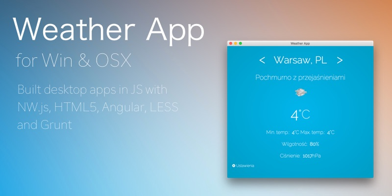
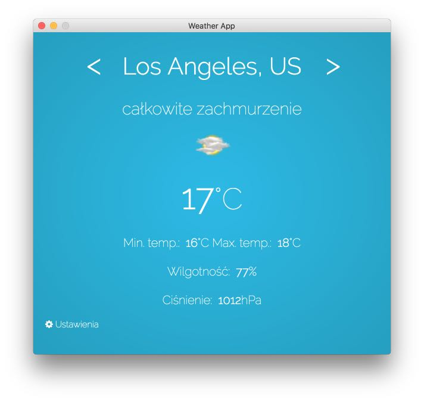
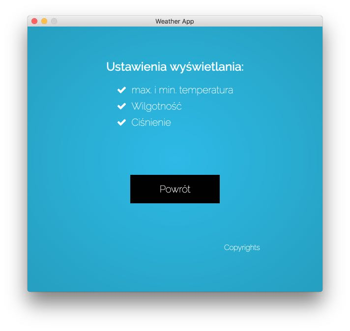

# Weather App
 Simple weather desktop application built with NW.JS, Angular, HTML, Less and Open Weather API.



### Application layout (OSX)



### Application settings (OSX)



## Getting Started

### 1) Clone project repo:
 ```
 https://github.com/michaelmoney/weatherApp.git
 ```
 
```
 git@github.com:michaelmoney/weatherApp.git
 ```

### 2) In terminal run:
```
npm install
```

### 3) Dev mode (with file watchers):
```
grunt serve
```

### 4a) Build package for OSX:
```
grunt build:osx
```

### 4b) Build package Windows:
```
grunt build:win
```

### 5) Open application from
```
/build/WeatherApp/{OS}/
```

